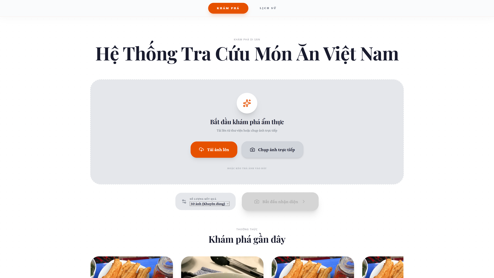
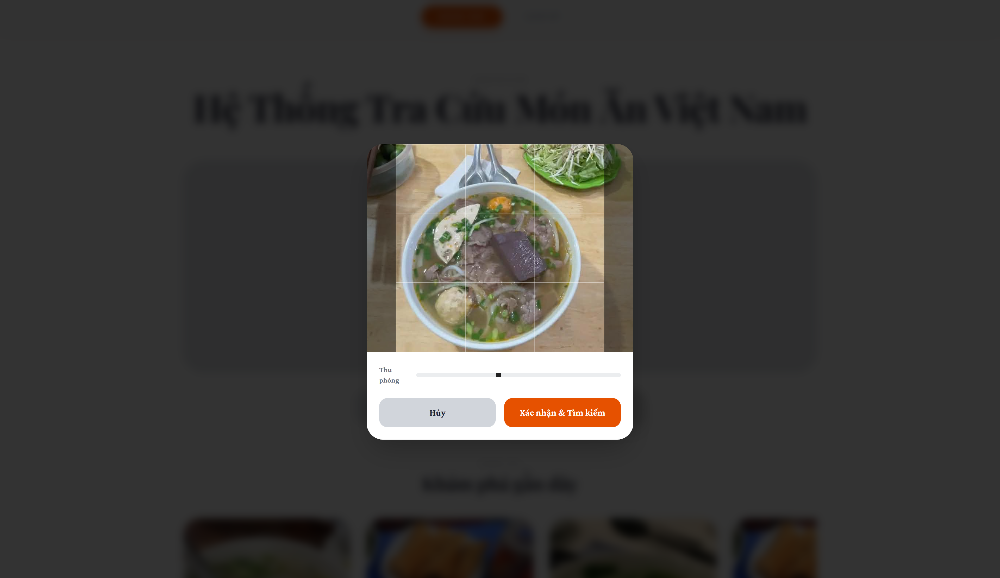
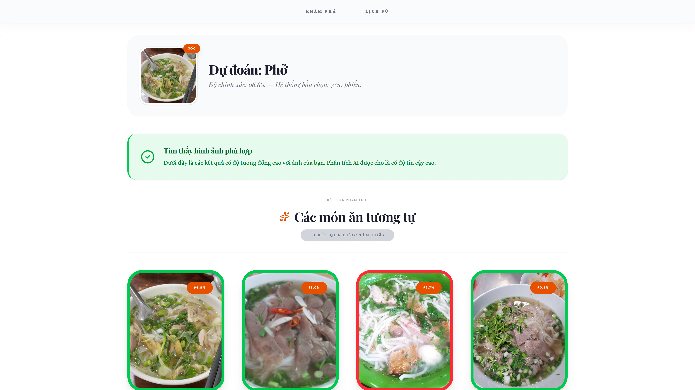
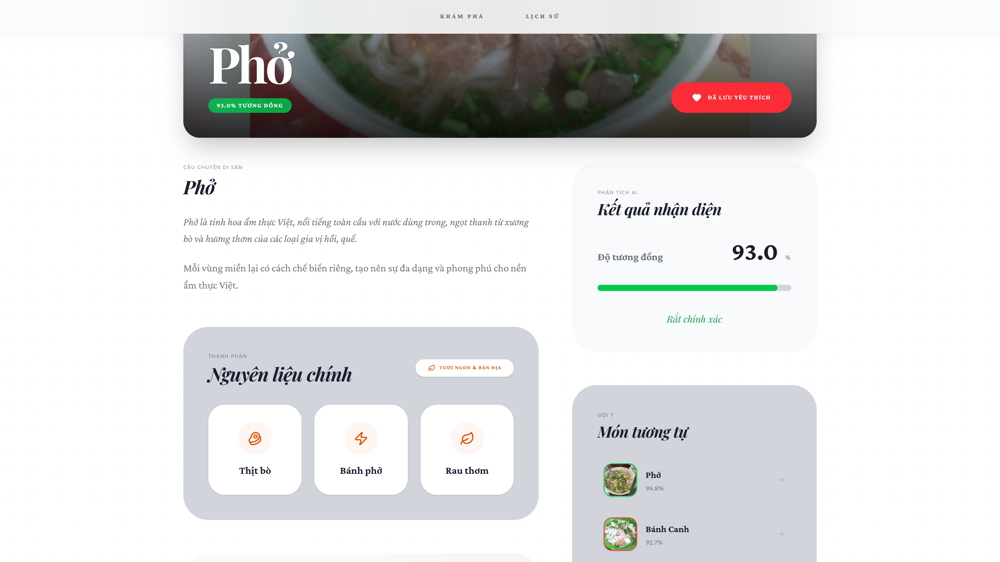
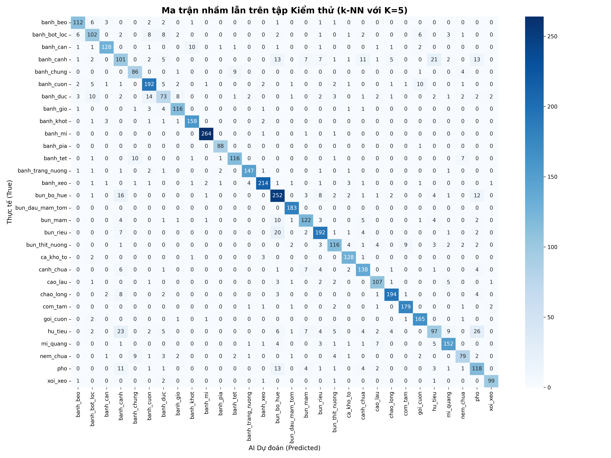
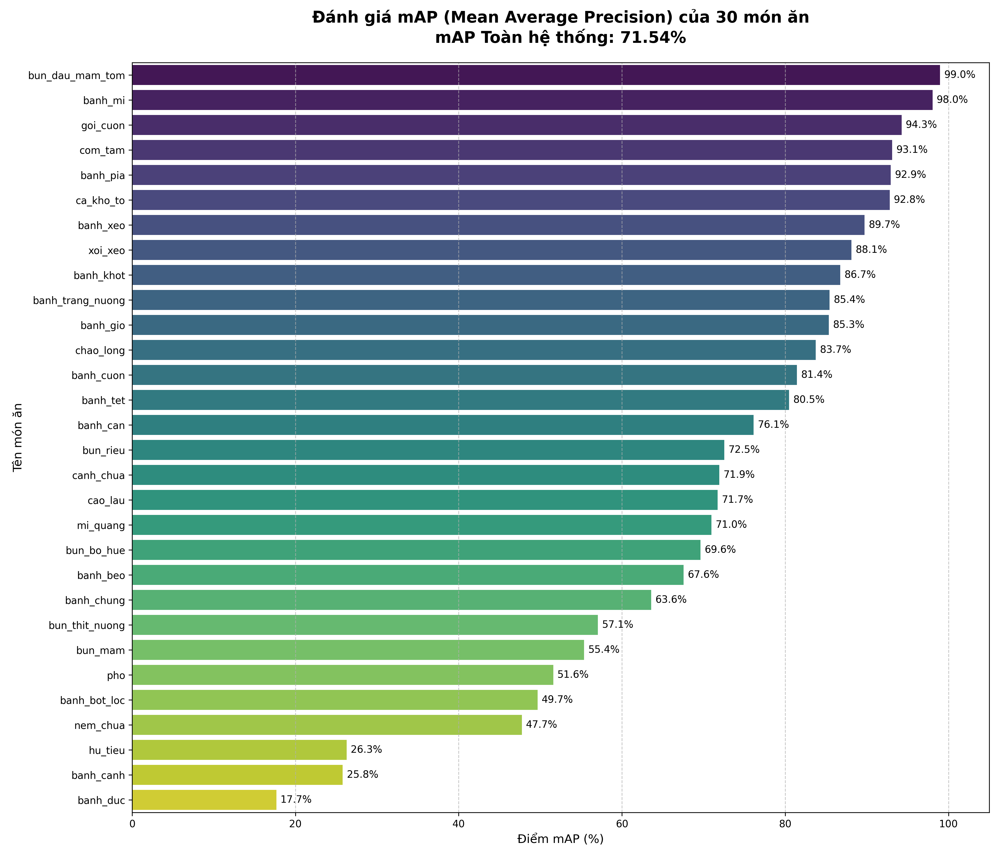
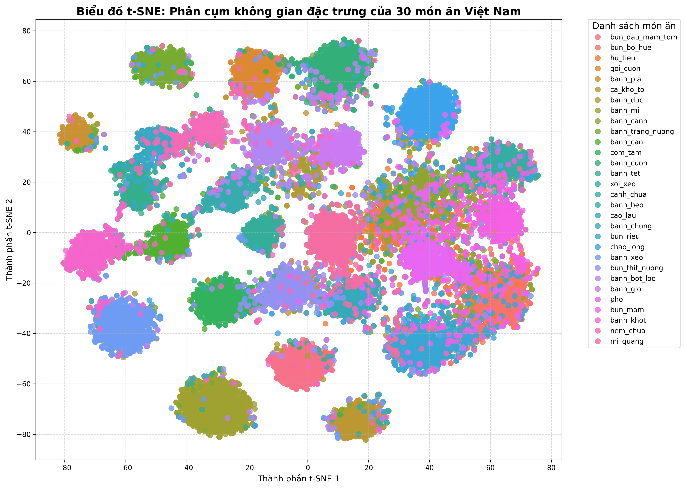

# Vietnamese Food Images Searcher
**Hệ thống tra cứu và nhận diện món ăn Việt Nam bằng hình ảnh**


Ứng dụng web tích hợp Trí tuệ nhân tạo (AI) giúp người dùng nhận diện và tìm kiếm các món ăn truyền thống của Việt Nam thông qua hình ảnh tải lên hoặc chụp trực tiếp từ camera.

🔗 **[Trải nghiệm trực tiếp ứng dụng tại đây (Live Demo)](https://vnfood-searcher.vercel.app)**

---

## Giao diện ứng dụng (Screenshots)

<p align="center">
  
  
  <br>
  
  <br>
  
</p>

---

## Tính năng
* **Nhận diện món ăn:** Sử dụng mô hình Deep Learning để trích xuất đặc trưng và tìm kiếm món ăn tương đồng.
* **Tương tác linh hoạt:** Hỗ trợ giao diện đa nền tảng, kéo thả (Drag & Drop), và chụp ảnh trực tiếp từ Webcam.
* **Lịch sử tìm kiếm:** Lưu trữ các ảnh đã tra cứu gần đây để xem lại dễ dàng.

---

## Đánh giá mô hình AI (Model Evaluation)

Hiệu suất của mô hình trích xuất đặc trưng được đánh giá qua các biểu đồ dưới đây:

### 1. Ma trận nhầm lẫn (Confusion Matrix)
Cho thấy khả năng phân loại chính xác của mô hình và các nhãn món ăn dễ bị nhầm lẫn với nhau nhất.
<p align="center">
  
</p>

### 2. Biểu đồ mAP (Mean Average Precision)
Đánh giá độ chính xác trung bình của hệ thống truy xuất hình ảnh (Image Retrieval) trên từng lớp món ăn (per class).
<p align="center">
  
</p>

### 3. Phân cụm t-SNE (t-SNE Clusters)
Biểu đồ giảm chiều dữ liệu t-SNE thể hiện cách AI phân cụm các không gian vector đặc trưng của từng món ăn. Các cụm tách biệt rõ ràng chứng tỏ mô hình học được các đặc trưng rất tốt.
<p align="center">
  
</p>

---

## Hướng dẫn Cài đặt & Khởi chạy cục bộ (Local Development)

### 1. Cài đặt Backend (AI & API)
Mô hình yêu cầu Python 3.12.6.

1. Tải Dataset gốc tại đây: [dataset](https://kaggle.com/datasets/7798c74aaa30de6318880ec6e21732aa7ff88d3c97d7fd59a626e6ff30b71fea)

2. Tải trọng số mô hình (Weights)
```bash
git lfs install
git lfs pull
```
3. Đồng bộ và trích xuất Vector (Chỉ chạy khi có ảnh mới thêm vào dataset)
python feature_manager.py

4. Khởi chạy API Server
```bash
python main.py
```

*API sẽ chạy mặc định tại `http://127.0.0.1:5000`*

### 2. Cài đặt Frontend (React + Vite)

Mở một terminal **mới** và thực hiện:

```bash
# 1. Di chuyển vào thư mục frontend
cd frontend

# 2. Cài đặt các thư viện cần thiết
npm install
npm install react-webcam react-easy-crop

# 3. Khởi chạy Frontend server
npm run dev

```

*Giao diện web sẽ hiển thị tại `http://localhost:3000`*

---
